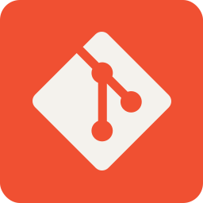
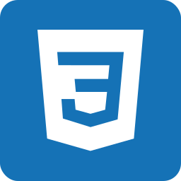

  

<h3 align="center">
    Hi, I'm Marcos Rodrigo
    
</h3>

  

## <picture></picture> About me

<!-- <picture> </picture> -->

- 🎓 Telecommunication Engineer and PhD student at the Grupo de Tratamiento de Imágenes — Universidad Politécnica de Madrid

- 🧪 Researching **Vision Transformers** & **Multimodal Generative Models** for face recognition and long‑form video summarization

- 👨‍🏫 University lecturer for Vision Analysis & Deep Learning and mentor of MSc theses

- 📝 Author of peer‑reviewed publications

- ✨ Outside the lab you’ll find me practicing tricking (extreme martial arts), boxing or planning my next trip across the globe

- 📫 Reach me via email at [marcosrodrigo5@hotmail.com](marcosrodrigo5@hotmail.com)

## 🛠️ Tech Toolbox

<table>
  <!-- ---------- 1st ROW ---------- -->
  <tr>
    <td align="center">
      <kbd>Programming&nbsp;&amp;&nbsp;Scripting</kbd> 
      
      
      
      
      
      
      
      
    </td>
    <td align="center">
      <kbd>Cloud&nbsp;&amp;&nbsp;DevOps</kbd> 
      
      
      
      
      
      
      
    </td>
    <td align="center">
      <kbd>IDEs&nbsp;&amp;&nbsp;Editors</kbd> 
      
      
      
      
      
    </td>
  </tr>
  <!-- ---------- 2nd ROW ---------- -->
  <tr>
    <td align="center">
      <kbd>AI / ML</kbd> 
      
      
      
      
      
      
      
      
      
      
      
      
    </td>
    <td align="center">
      <kbd>Web / Backend</kbd> 
      
      
      
      
      
      
    </td>
    <td align="center">
      <kbd>OS&nbsp;&amp;&nbsp;Distros</kbd> 
      
      
      
      
      
      
    </td>
  </tr>
  <!-- ---------- 3rd ROW ---------- -->
  <tr>
    <td align="center">
      <kbd>GenAI&nbsp;&amp;&nbsp;LLMs</kbd> 
      
      
      
      
      
      
      
      
    </td>
    <td align="center">
      <kbd>Media&nbsp;&amp;&nbsp;Design</kbd> 
      
      
      
      
      
    </td>
    <td align="center">
      <kbd>Docs&nbsp;&amp;&nbsp;Writing</kbd> 
      
      
      
    </td>
  </tr>
</table>

## <picture></picture> Profile Statistics

    

### 🤝Connect with me

    
    

